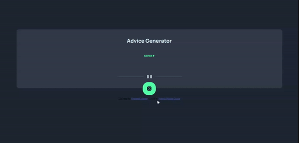

# Gerador de conselhos 

## Objetivo 🎯
Esse projeto tem como objetivo criar uma página na qual o usuário, ao clicar na imagem do dado, recebe um conselho selecionado de maneira aletória.

## Tecnologias 💻

  

## Get started 🏁

1. Primeiro você deve baixar o diretório, para isso você deve clica no ícone "Code" apresentado abaixo

2.Em seguida clicar em Download ZIP

3.Encontre o arquivo ZIP baixado e o extraia para um local de sua preferência;

4.Dentro da pasta extraída do ZIP procure o arquivo de nome index e clique para abri-lo;

5.Prontinho, você acessou o projeto e já pode usá-lo 🥳

